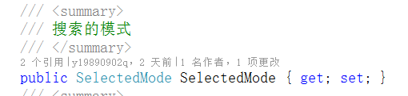

# 向大家分享在项目中编写的比较实用的控件：AutoCompleteTextBox
### lib文件夹中放的是控件的源码dll，该dll包含大量本人在这几年项目中的控件，现在逐步编写到github上，[github地址](https://github.com/y19890902q/MyWPFUI.git)
* 依赖属性ItemsSource、DisplayMemberPath、SelectedItem 跟普通的combobox的用法一样
* 普通属性SelectedMode指是否开启匹配汉字拼音首字母，略微有一点点的性能消耗。5万以上的量还是可以的。

# 演示

